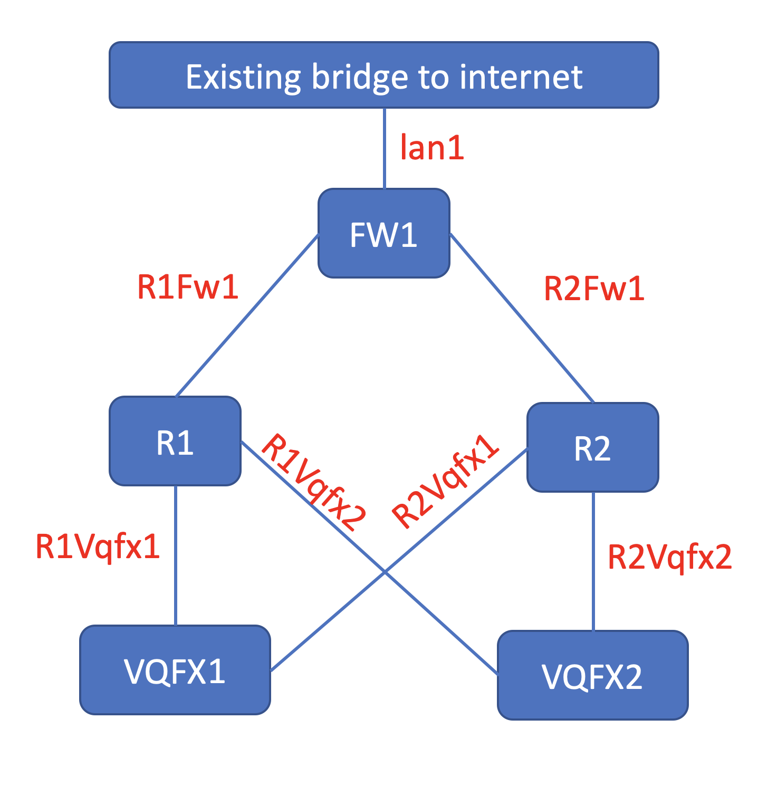

# Script to Deploy Junos VM on KVM, next-gen version
release 0.2

## Overview
This script is used to deploy Junos VM (vMX, vQFX, vSRX, and vRR) on KVM, which is useful to create network topology for testing purposes.

This script has been tested on the Ubuntu Linux 18.04 and Centos 7.7)

## Caveat
Some caveats on using this script
1. pynetlinux library
	- to install pytnetlinux library, clone the source from github
	- before seting up the library, make sure that all the necessary development tool and library are installed (such as compiler, libvirt-development-library, etc)

2. setting MTU on centos.

Unfortunately the QEMU library on centos is the old one and it doesn't support MTU setting.
To fix this, you can either install the latest library or edit junos_vm_xml.py, by commenting line that set the mtu :

		# mtu=ET.Element("mtu",{'size':MTU})
		# i.insert(0,mtu)

## Requirement
This script requires the following :
- Python3 (this script requires Python3)
- PyEZ (to install use `pip3 install junos-eznc`)
- passlib library (to install use `pip3 install passlib`)
- pexpect library (to install use `pip3 install pexpect`)
- libvirt python library
- dnsmasq server as DHCP server
- tftp server to provide initial configuration
- pynetlinux library https://github.com/rlisagor/pynetlinux

## Junos VM image
For VMX, use the official vMX release from juniper, **[vmx](http://www.juniper.net/support/downloads/?p=vmx#sw)**. Download the KVM version, uncompres and untar the file, and get four (4) files from image directory (three files for RE are`junos-vmx-***.qcow2`, `vmxhdd.img` and `metadata-usb-re.img`, and one file for PFE is `vFPC-***.img`)

For VSRX,use the official vSRX release from juniper, **[vsrx](http://www.juniper.net/support/downloads/?p=vsrx#sw)**. Download the KVM Version.

For vRR, use the official vRR release from juniper, **[vrr](http://www.juniper.net/support/downloads/?p=vrr#sw)**. Download the KVM version (format `img`)

For vQFX use the vQFX trial from juniper, **[vqfx](http://www.juniper.net/support/downloads/?p=vqfxeval#sw)**.
By default vQFX image only support ZTP on interface xe-0/0/N. it doesn't support ZTP on management interface (em0). To make vQFX image able to do ZTP over em0 interface, please follow this instruction **[vqfx_hacked](vqfx_hacked.md)**

## Script Files

This tool consist of the following script
- **[junos_vm.py](junos_vm.py)**
- **[junos_vm_xml.py](junos_vm_xml.py)**
- **[createvm.py](createvm.py)**

## junos_vm.py
This script is the library with functions used by the other scripts (`createvm.py`)

## createvm.py
This script will read the definition file (a yaml file), which contain the following information :
- image files used by Junos VM
- the source directory for the Junos VM's image
- destination folder where the images will be stored
- the VMs definition (such as type : vMX/vSRX/vQFX/vRR, interfaces used by VM)
- bridge used for connection between VMs and its type (lb : for linuxbridge, and ovs: for openvswitch)
- IP address of management interface of each VM

This script will do the following (depend on the argument given to the script)
- argument `addbr`,  this script will create bridges on linux host (bridge which is used for connecting VMs), this script must be run with sudo
- argument `delbr`, this script will delete bridges on linux host, this script must be run with sudo
- argument `definevm`, this script will create VM instance (domain), copy VM's image files from source to destination directory, create `dnsmasq.conf` for the DNSMASQ DHCP server, and initial configuration for each virtual junos instances. 
- argument `undefinevm` this script will delete VM's image files and remove VM instances (domain) from the hypervisor
- argument `start <vm_name | all>`, this script will start start VMs instances on hypervisor
- argument `stop <vm_name | all>`, this script will start stop VMs instances on hypervisor

## How to run the script
1. Create a working directory (for example ~/lab1), and create the definition file (sample **[topo5.yaml](topo5.yaml)**)  inside this directory
2. Copy the Junos VM images into the source directory (please refer to the definition file for this)
3. Run script to create the bridge, for example **createvm.py -c topo5.yaml addbr**
4. Run script to create VM instances and copy the VM image, for example **createvm.py -c topo5.yaml definevm**
5. copy file `dnsmasq.conf` into /etc or add it into the existing DNSMASQ configuratio file, and restart DNSMASQ service
6. copy junos VM initial configuration (*.conf) into TFTP home directory, for example /var/lib/tftboot. Verify that TFTP service is up and running
7. Run script to run the VM intances. it can be **createvm.py -c topo5.yaml start all**, to start all instances at the same time or it can be **createvm.py -c topo5.yaml start <node_name>**, to start the instance one by one
8. Wait for 5 to 10 minutes (depend on how many Junos VMs that you define in your topology) for the VMs to be up and running
9. To verify, try to access the console port of the Junos VMs (if you get `login:` prompt, it means the VM is up and running) or ping the management ip address of the Junos VM
10. To stop the VM instances,  it can be **createvm.py -c topo5.yaml stop all**, to stop all instances at the same time or it can be **createvm.py -c topo5.yaml stop <node_name>**, to stop the instance one by one
11. To remove the VM instances and VM image files, run **createvm.py -c topo5.yaml undefinevm**

here is the topology for the sample definition file 

## Basic command
- `virsh list` : to display the running VMs
- `virsh console <id>` or `virsh console <name>` to access the VM through serial console ... To exit the console access, press button `ctrl` and  `]`
- `brctl show` or `brctl show <bridge name>` : to display bridge that has been configured on the linux host

